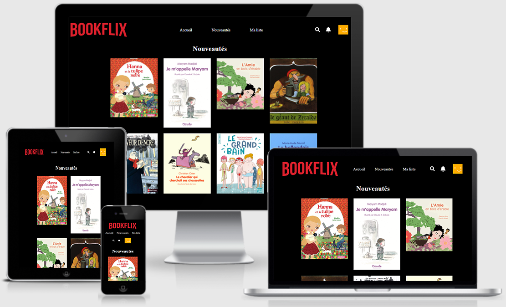

# Projet n°7 : Bookflix le Netflix des livres

## :mag: Aperçu

## :bookmark_tabs: Sommaire
<ol>
    <li><a href="#sujet">Sujet</a></li>
    <li><a href="#demandes_respecter">Demandes à respecter</a></li>
    <li><a href="#objectifs_projet">Objectifs du projet</a></li>
    <li><a href="#technologies_utilisees">Technologies utilisées</a></li>
    <li><a href="#prerequis">Prérequis</a></li>
    <li><a href="#installation">Installation</a></li>
    <li><a href="#utilisation_siteweb">Utilisation du site web</a></li>
    <li><a href="#auteurs_contributeurs">Auteurs et contributeurs</a></li>
    <li><a href="#licence">Licence</a></li>
</ol>

## :page_facing_up: 1. Sujet 

Vous avez été contacté par une enseignante d'une école primaire qui souhaiterait créer un site se nommant Bookflix, venant d'une idée trouvé sur internet présentant un Netflix pour les livres.

Le site doit être disponible le lendemain matin, et avez donc 4 heures pour réaliser se site.

Le site doit respecter un maximum la maquette fourni, et tous les éléments fournis doivent être présent.

Le site doit être accessible depuis une URL, sans rien télécharger, il n'y a aucun budget alloué.

Le site doit être aussi totalement responsive pour pouvoir être consulté aussi bien sur un ordinateur, qu'un téléphone, ou une télévision.

## :memo: 2. Demandes à respecter 

* Le site doit respecté la maquette Bookflix.
* Tous les éléments fournis doivent être présents.
* Le site doit être accessible sans rien télécharger.
* Le site doit être accessible depuis une URL (pas de budget alloué pour l'hébergement).
* Le site doit être totalement responsive.

## :checkered_flag: 3. Objectifs du projet 

* Répondre à une demande dans un temps limité, tout en respectant les bonnes pratiques et nomenclatures.

## :computer: 4. Technologies utilisées 

* HTML
* CSS / Sass
* Git & GitHub

## :exclamation: 5. Prérequis 

Aucun

## :wrench: 6. Installation 

Cloner ce repository.

## :question: 7. Utilisation du site web 

Ouvrir le fichier index.html sur un navigateur web.

## :beers: 8. Auteurs et Contributeurs 

Timoté Lancelle : [GitHub](https://github.com/LancelleTimote) / [LinkedIn](https://www.linkedin.com/in/timote-lancelle-devweb/)

## :page_with_curl: 9. Licence 

Distribué sous la licence MIT. Voir le fichier [LICENSE](LICENSE) pour plus d'informations.